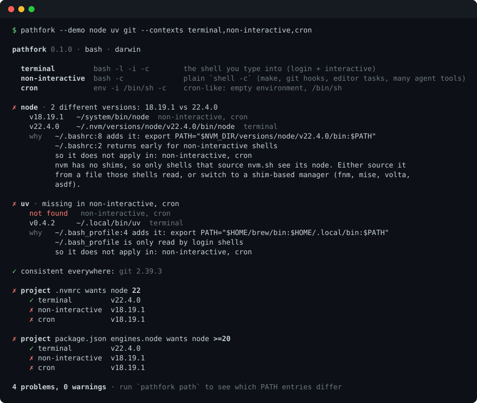

# pathfork

**Your tools work in your terminal but not in cron, editor tasks, git hooks or agent shells. pathfork shows where `node`, `python`, `git` resolve differently, and which startup-file line is to blame.**

[](https://github.com/Nithinfgs/pathfork/actions/workflows/ci.yml)
[](LICENSE)


<p align="center">
  
</p>

```bash
npx github:Nithinfgs/pathfork --demo     # see it work in a throwaway sandbox, touches nothing
npx github:Nithinfgs/pathfork            # check your real setup
```

## In 20 seconds

A shell does not read the same files every time it starts. `~/.zshrc` runs for the terminal you type into, but not for `cron`, a Makefile, a git hook, a VS Code task, or the shell a coding agent spawns. If `nvm`, `pyenv`, `fnm` or a `PATH` export lives in the wrong file, you get the classic:

> "It works in my terminal." / `node: command not found` in CI-like contexts / the wrong Python in a hook.

pathfork starts your shell the five ways it commonly starts, runs `command -v` and `--version` for each tool in every context, groups identical results, and for every difference points at the file and line that caused it.

## Why this exists

The usual debugging loop is `echo $PATH` in one place, `echo $PATH` in another, and squinting. `which -a` only shows one context. Version managers make it worse: nvm only exists in shells that sourced `nvm.sh`, and a `case $- in *i*) ;; *) return;; esac` guard at the top of `.bashrc` silently skips everything below it for non-interactive shells. Coding agents and editor task runners made this more visible, because they run commands in exactly the shells your dotfiles were never written for.

## Quick start

Requires Node 18+ and zsh, bash or sh on macOS or Linux.

```bash
npx github:Nithinfgs/pathfork                      # common dev tools: node, npm, python3, git, go, cargo, ...
npx github:Nithinfgs/pathfork node python3 uv      # specific commands
npx github:Nithinfgs/pathfork --project            # also check .nvmrc, .tool-versions, package.json engines, ...
npx github:Nithinfgs/pathfork path                 # which PATH entries are missing where, and which file adds them
```

(`npx pathfork` will work once the package is published to npm; until then use the GitHub form above or clone the repo.)

## Example

```text
✗ node · 2 different versions: 18.19.1 vs 22.4.0
    v18.19.1   ~/system/bin/node  login, non-interactive, cron, gui
    v22.4.0    ~/.nvm/versions/node/v22.4.0/bin/node  terminal
    why   ~/.bashrc:8 adds it: export PATH="$NVM_DIR/versions/node/v22.4.0/bin:$PATH"
          ~/.bashrc:2 returns early for non-interactive shells
          so it does not apply in: login, non-interactive, cron, gui
          nvm has no shims, so only shells that source nvm.sh see its node. ...

✗ project .nvmrc wants node 22
    ✓ terminal         v22.4.0
    ✗ login            v18.19.1
    ✗ non-interactive  v18.19.1
```

This is the output of `pathfork --demo`, which builds a fake `HOME` containing a typical broken setup so you can see the report without exposing your own machine.

## What it checks

| Context | Started as | Typically what runs this way |
|---|---|---|
| `terminal` | login + interactive shell | the shell you type into |
| `login` | `$SHELL -l -c` | `ssh host cmd`, some CI runners |
| `non-interactive` | `$SHELL -c` | Makefiles, git hooks, many editor task runners and agent tools |
| `cron` | `env -i /bin/sh -c`, `PATH=/usr/bin:/bin` | cron, many service managers |
| `gui` | `env -i /bin/sh -c`, launcher `PATH` | apps launched from the Dock or a launcher (approximation) |

Every shell context starts from a minimal environment (`HOME`, `USER`, `SHELL`, `TERM`, launcher `PATH`), so the result shows what your startup files contribute and does not depend on which terminal you ran pathfork from. Use `--inherit-env` to start shells from the current environment instead.

## Features

- **Divergence report**: per command, grouped by resolved path and version, ranked error (missing, or different major version), warning (different minor/patch), info (same version, different install).
- **Root cause**: finds the startup-file line that adds the directory, knows which contexts read which file, and detects interactive guards in `.bashrc`.
- **Version-manager aware**: nvm, pyenv, rbenv, asdf, mise, fnm, Volta, SDKMAN, conda, Homebrew, each with a hint about how that tool behaves in non-interactive shells.
- **Project requirements**: `.nvmrc`, `.node-version`, `.tool-versions`, `.python-version`, `.ruby-version`, `package.json` `engines.node` (ranges such as `>=18 <22`, `^18 || ^20`), `go.mod`. Specs it cannot interpret (`lts/*`) are reported as unchecked, not guessed.
- **PATH matrix**: `pathfork path` shows every PATH entry that is not present in all contexts, with the file and line that adds it.
- **Outputs**: coloured terminal, `--json`, and `--md` for pasting into an issue or PR.
- **CI-friendly exit codes**: `0` consistent, `1` problems found, `2` usage error. `--strict` also fails on warnings.
- **Zero runtime dependencies**, read-only, no network.

## How it works

```
 contexts.js ──► probe.js ──► compare.js ──► explain.js ──► render.js
 build 5 shell   run one script  group by real   find the rc line   text / json / md
 invocations     per context;    path + version;  that adds the dir;
                 sentinel-tagged classify         who reads which
                 output          severity         file; guards
```

1. `src/contexts.js` builds the invocations (`zsh -l -i -c`, `bash -c`, `env -i /bin/sh -c`, ...) with a minimal environment.
2. `src/probe.js` runs one small POSIX script per context: `command -v` plus `<cmd> --version` for each command. Output lines carry `@@PATH@@` / `@@CMD@@` markers, so banners and noise from your rc files are ignored. Command names are validated against `[A-Za-z0-9._+-]`.
3. `src/compare.js` resolves symlinks, groups contexts with identical results and classifies severity.
4. `src/explain.js` scans the startup files that apply to your shell, skipping comments, for lines that mention the directory (as an absolute path, `$HOME/...` or `~/...`) or a known version manager's init, and works out which contexts read that file.

pathfork runs your shell startup files, because that is the point. It does not modify any file, and `--demo` only touches a temp directory it deletes afterwards.

## Use cases

- A CI-like script, hook or Makefile target fails with `command not found` but the same command works when you type it.
- You want to know which `node` your editor tasks, git hooks or coding agent will actually get before it runs your test suite on the wrong version.
- Onboarding: run `pathfork --project --md` and paste the result into an issue instead of exchanging screenshots of `echo $PATH`.
- Guarding a team dotfiles repo: `pathfork --project` in CI of a devcontainer or bootstrap script, exiting `1` when a required version is not available in the non-interactive context.

## Options

```
pathfork [command...]          check commands (default: common dev tools)
pathfork path                  show PATH entries that differ between contexts
pathfork --demo                try it in a throwaway sandbox

--project[=dir]       also check version files in dir (default: .)
--contexts a,b        only these contexts: terminal, login, non-interactive, cron, gui
--shell <path>        shell to test (default: $SHELL); zsh, bash, sh, dash
--inherit-env         start shells from this process's environment
--json | --md         machine-readable / issue-friendly output
--strict              exit 1 on warnings too
--timeout <seconds>   per-context timeout (default 20)
--no-color            disable colour (NO_COLOR and FORCE_COLOR are honoured)
```

## Limitations

- The contexts are models of how shells start, not recordings of specific programs. A real cron daemon, launchd or a particular editor may set additional variables; `gui` is the weakest approximation.
- macOS `path_helper` and `/etc` startup files are executed (they are part of a real login) but are reported as "not set in your startup files" when no line in your own files matches.
- Line matching is textual. Sourced files (`source ~/.config/shell/paths.sh`) are not followed yet.
- fish, nushell and Windows are not supported.
- Version detection takes the first `\d+.\d+...` token from `--version` output.

## Roadmap

- Follow `source` / `.` includes when locating the responsible line
- fish support
- `pathfork fix`: print a unified diff for the suggested change without applying it
- Real Linux GUI environment via `systemctl --user show-environment`
- More project files: `rust-toolchain.toml`, `.sdkmanrc`, `mise.toml`

Ideas and bug reports with `--md` output are welcome.

## Contributing

See [CONTRIBUTING.md](CONTRIBUTING.md). Tests are hermetic (temporary `HOME`, fake executables): `npm install && npm run check`.

## License

[MIT](LICENSE)
